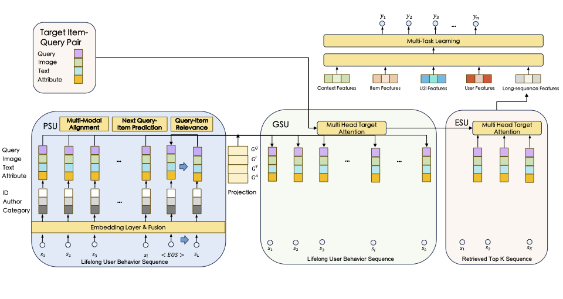

### SEMINAR: Search Enhanced Multi-modal Interest Network and Approximate Retrieval for Recommendation
#### Code and Dataset Under Review 



##### Requirements
```shell script
pip3 install torch clip pillow faiss-cpu func_timeout tqdm
```

##### Pretrained-Model
Multi-Modal Pretrained Model-CLIP
Download ViT-B-32.pt checkpoint and put the file ViT-B-32.pt into folder as ./SEMINAR/download/ViT-B-32.pt
```shell script
    cd ./SEMINAR/download
    wget https://openaipublic.azureedge.net/clip/models/40d365715913c9da98579312b702a82c18be219cc2a73407c4526f58eba950af/ViT-B-32.pt
    ## Download Other models, such as Resnet Vit-L etc, see below scripts:
    ./run_download_pretrained_model.sh
```

#### Baseline Models

| MODELS |              PAERS               |
|:------:|:--------------------------------:|
|  SIM   | https://arxiv.org/abs/2006.05639 |
|  ETA   | https://arxiv.org/abs/2209.12212 |
|  QIN   | https://arxiv.org/abs/2310.06444 |
|  TWIN  | https://arxiv.org/abs/2302.02352 |


We are implementing SOTA long user sequence models in recommendation in pytorch, including SIM, ETA, QIN, TWIN 
and our proposed SEMINAR. The dataset and train/eval/test code is modified from the original implementation of S3-Rec (https://github.com/RUCAIBox/CIKM2020-S3Rec).
Thanks for their contribution.

## Experiments
### Amazon Movie and TV
#### Data Preparation
##### download 5-core data from Amazon Review dataset website (https://cseweb.ucsd.edu/~jmcauley/datasets/amazon_v2/)
```shell script
mkdir ./SEMINAR/data/Amazon_movie_tv_5/
wget https://datarepo.eng.ucsd.edu/mcauley_group/data/amazon_v2/categoryFilesSmall/Movies_and_TV_5.json.gz ./SEMINAR/data/Amazon_movie_tv_5/Movies_and_TV_5.json.gz
wget https://datarepo.eng.ucsd.edu/mcauley_group/data/amazon_v2/metaFiles2/meta_Movies_and_TV.json.gz ./SEMINAR/data/Amazon_movie_tv_5/meta_Movies_and_TV.json.gz
```

##### process data file 
```shell script

# Dataset Preparation
## generate Amazon Movies_and_TV
python3 data_process.py
## generate multi-modal embedding data
python3 generate_multimodal_embedding.py
## Generate Sample data
python3 generate_test.py

```

The data folder should look like

```shell script
cd ./data/
Amazon_movies_tv_5			KuaiSAR_final
Movies_and_TV_item2attributes.json	generate_test.py
Movies_and_TV_queries.txt		kuaisar.txt
Movies_and_TV.txt			Movies_and_TV_sample.txt		kuaisar_item2attributes.json
Movies_and_TV_id2dummy_query.json	Movies_and_TV_sample_queries.txt	kuaisar_queries.txt
Movies_and_TV_id2image_emb.pth		data_process.py				kuaisar_sample.txt
Movies_and_TV_id2title_emb.pth		generate_multimodal_embedding.py
```

#### Running Experiments

```shell script
## Comparing Multiple Baseline methods
run_train_seminar_amazon.sh
```

### KuaiSAR
#### Data Preparation

```shell script
## Dataset Website
mkdir ./SEMINAR/data/KuaiSAR_final/

https://kuaisar.github.io/
https://zenodo.org/records/8181109
```

#### Running Experiments
```shell script
run_train_seminar_kuaisar.sh
```

### Alipay Short Video
An industrial dataset which is not released and currently not publicly available yet


## Reproduce

### A.Multi-Modal Recommendation
Please check the methods to reproduce the results of the public datasets Amazon and KuaiSAR.

```shell script
cd ./reproduce
run_reproduce_seminar_amazon.sh
run_reproduce_seminar_kuaisar.sh
```

We also attached the logs of the training and evaluation process below
```shell script

# amazon training logs
ls ./log
amazon_eta_train.log		amazon_sim_train.log
amazon_qin_train.log		amazon_seminar_train.log	amazon_twin_train.log
kuaisar_eta_model.log		kuaisar_seminar_model.log	kuaisar_twin_model.log
kuaisar_qin_model.log		kuaisar_sim_model.log

cd ./log
tail -f amazon_seminar_train.log

```

### B.Approximate Fast Retrieval of Multi-Modal Embedding
```shell script
cd ./inference
python3 eval_seminar_recall.py

```
